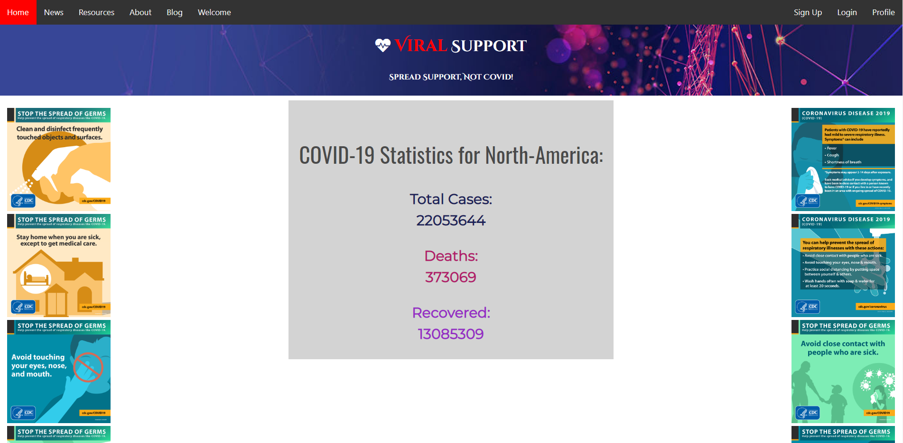
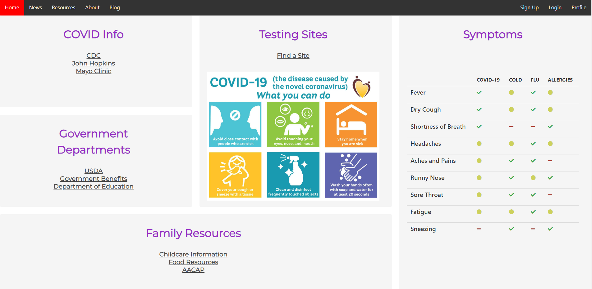

# ViralSupport 

ViralSupport is a COVID-19 resource center aimed to provide relevent information/data to those seeking it. 

## User Story

User Story: As someone has been affected by the corona virus, I want a site that provides me with information about about covid19 stats and safety tips. This site should allow me to chat with others and share testimonies or experiences. I should be able to create a profile that saves my information and enables other users to provide support

## Table of Contents
* [Links](#Links)
* [Screenshots](#Screenshots)
* [Installation](#installation)
* [License](#license)
* [Contributing](#contributing)
* [Tests](#tests)
* [Technologies](#Technologies)
* [contributors](#contributors)

## Links

* Github: https://github.com/Henryrjung/ViralSupport
* Heroku: 

## Screenshots
### Homepage

### Resources

  
## Installation

Please use the heroku link provided to access the website

## License

MIT

## Contributing

Please email me with any questions or contributions

## Tests

there are currently no ongoing tests for the project

## Technologies

* Bulma
* Socket.io
* express
* express-handlebars
* express-session
* jquery
* MySQL
* passport
* rapidapi.com

## Contributors

* Henry Jung
* Victoria Rouser
* Gavin Riggs
* Beth Spencer
